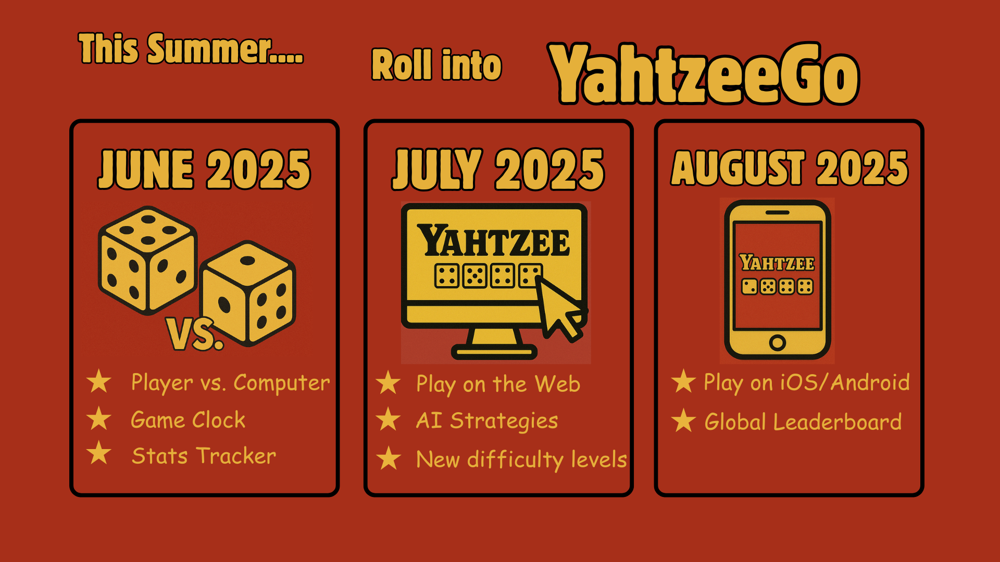

# Yahtzee public roadmap

## Quick Visual Overview (Summer 2025)

## Formal Roadmap Documentation

:sparkle: View the [official Yahtzee public product roadmap](https://github.com/users/wbgregory/projects/1/views/1)[^1]

Our product roadmap is where you can learn about what features we're working on, what stage they're in, and when we expect to bring them to you. Have any questions or comments about items on the roadmap? Share your feedback via issues or contact the media team directly at media@yahtzeego.com

The roadmap repository is for communicating Yahtzee’s roadmap. Existing issues are currently read-only, and we are locking conversations, as we get started. Interaction limits are also in place to ensure issues originate from GitHub. We’re planning to iterate on the format of the roadmap itself, and we see potential to engage more in discussions about the future of GitHub products and features.

## Guide to the roadmap

Every item on the roadmap is an issue, with a label that indicates each of the following:

- A **release phase** that describes the next expected phase of the roadmap item. See below for a guide to release phases. 

- A **feature area** that indicates the area of the product to which the item belongs. For a list of current product areas, see below.

- A **feature** that indicates the feature or product to which the item belongs. For a list of current features, see below. 

- One or more **product SKU** labels that indicate which product SKUs we expect the feature to be available in. For a list of current product SKUs, see below.

- One or more **deployment models** (cloud, server, and/or ae). Where not stated, features will generally come out Cloud first, and follow on Server and GHAE at or soon after GA.

- Once a feature is delivered, the **shipped** label will be applied to the roadmap issue and the issue will be closed with a comment linking to the relevant [Changelog](https://github.blog/changelog/) post.

## Release phases

Release phases indicate the stages that the product or feature goes through, from early testing to general availability.

- **preview:** *Publicly available in full or limited capacity*\
Features mostly complete and documented. Timeline and requirements for GA usually published. No SLAs or support provided.

- **ga:** *Generally available to all customers*\
Ready for production use with associated SLA and technical support obligations. Approximately 1-2 quarters from Preview.

Some of our features may still be in the exploratory stages, and have no timeframe available. These are included in the roadmap only for early feedback. These are marked as follows: 

- **future:**\
Feature in discovery phase. We have not decided to build this feature, but are heavily considering it.

## Release phases - For YahtzeeGo

**YahtzeeGo release version dates**:
| **Version Number** | **Release Sprint** | **Release Notes** |
|-|-|-|
| 1.1.0 | Sprint 6 | -- |
| 1.2.0 | Sprint 7 | -- |
| 1.3.0 | Sprint 8 | -- |
| 1.4.0 | Sprint 9 | -- |
| 2.0 | Sprint 10 | -- |

## Roadmap stages

The roadmap is arranged on a project board to give a sense for how far out each item is on the horizon. Every product or feature is added to a particular project board column according to the quarter in which it is expected to ship next. Be sure to read the [disclaimer](#disclaimer) below since the roadmap is subject to change, especially further out on the timeline.  You'll also find an **Exploratory** column, which is used in conjunction with the **in design** and **exploring** release phase labels for when no timeframe is yet available.

GitHub Enterprise Server has major releases on a quarterly basis, and minor releases on a monthly basis. Once we know what version we are delivering a feature, we will update the issue to indicate that information.

## Feature Areas

The following is a list of our current product areas:

- **code:** Code experiences (Repositories, Pull Requests, Gists)
- **planning:** Planning and tracking tools (Issues, Projects)
- **code-to-cloud:** Code-to-cloud DevOps (Actions, Packages)
- **collaboration:** Collaboration features (Pages, Wikis, Discussions)
- **security & compliance:** Code security and compliance features
- **communities:** Community and social features
- **client-apps:** Client applications (Desktop, Mobile)
- **other:** Other features

## Feature

The following is a list of our current features and products, with distinct labels for filtering:

- **actions:** Yahtzee Actions
- **docs:** Yahtzee Docs
- **packages:** Yahtzee Packages
- **pages:** Yahtzee Pages

_More labels will be added in the future as needed._

## Product SKUs 

The following is a list of our current product SKUs. 

- **all:** Available to all users, including a free tier. Different SKUs may have different levels of functionality.
- **yahtzee team:** Yahtzee Team

## Disclaimer 

Any statement in this repository that is not purely historical is considered a forward-looking statement. Forward-looking statements included in this repository are based on information available to GitHub as of the date they are made, and GitHub assumes no obligation to update any forward-looking statements. The forward-looking product roadmap does not represent a commitment, guarantee, obligation or promise to deliver any product or feature, or to deliver any product and feature by any particular date, and is intended to outline the general development plans. Customers should not rely on this roadmap to make any purchasing decision.
